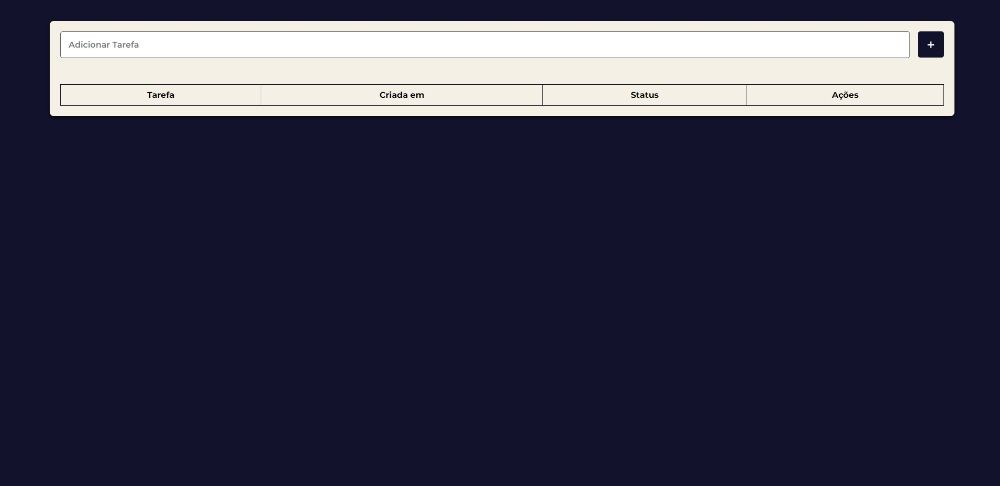
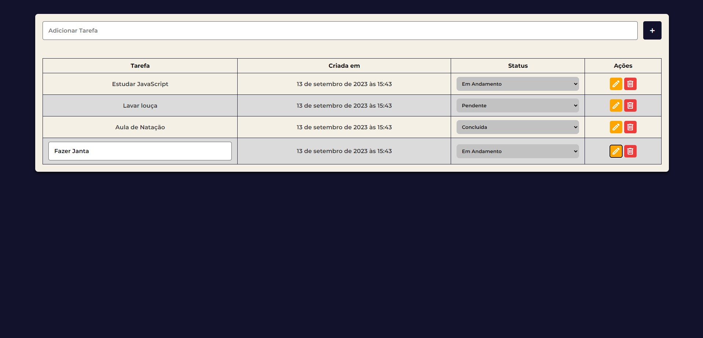
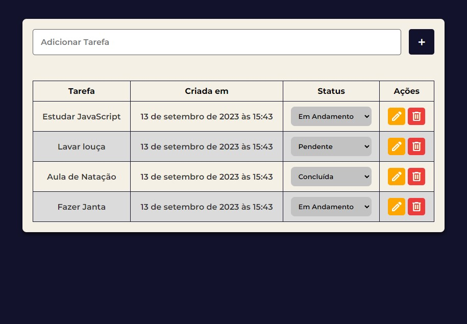
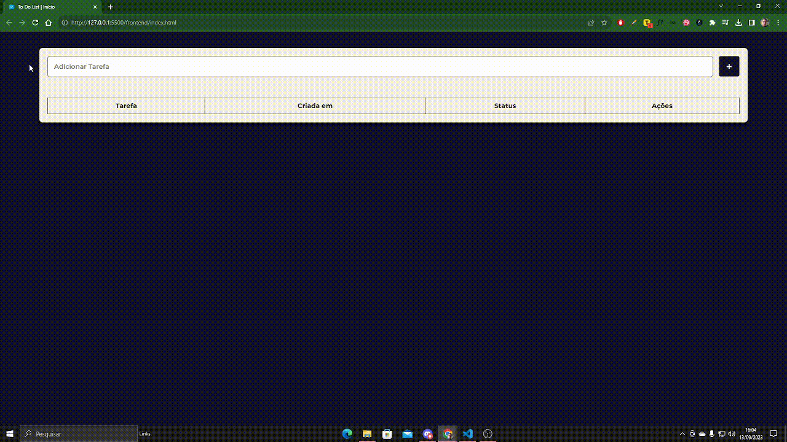

# ToDoList - Fullstack 📡


Um App de To-Do-List (Lista de Tarefas) utilizando API e Banco de Dados próprios - Feito com 💚

> Status do Projeto: Concluído... ✅

## Índice
- <a href="#funcionalidades">Funcionalidades do Projeto</a>
- <a href="#layout">Layout</a>
- <a href="#demonstracao">Demonstração</a>
- <a href="#rodar">Como rodar este projeto?</a>
- <a href="#tecnologias">Tecnologias Utilizadas</a>
- <a href="#autores">Pessoas Autores</a>
- <a href="#passos">Próximos Passos</a>

## Funcionalidades do Projeto - 🔨 <div id="#funcionalidades"></div>
- [x] Criar uma nova tarefa no Banco de Dados
- [x] Ver todas as tarefas criadas no Banco de Dados
- [x] Editar as tarefas já existentes no Banco de Dados
- [x] Deletar tarefas já existentes no Banco de Dados

## Layout - 🎨 <div id="#layout"></div>




## Demonstração - 💻 <a id="#demonstracao"></a>


## Como Rodar Este Projeto? - ⚙️ <div id="#rodar"></div>
### Back End
- É necessário ter instalado o <a href="https://www.docker.com/">`Docker`</a> no Seu computador
- É necessário ter instalado as extensões `Docker` e `Database Client` em seu VSCode
``` bash
# Clone este repositório
$ git clone https://github.com/FelipeKreulich/todolist-fullstack

# Acesse a pasta do projeto em seu terminal
$ cd todolist-fullstack

# Acesse a pasta do Back-End em seu terminal
$ cd backend

# Instale as dependências do Back-End
$ npm install

# Execute a aplicação
$ npm run dev

# A aplicação será inciada na porta
3333, acesse pelo navegador:
http://localhost:3333/tasks
```
### Front End
- É necessário ter a extensão `Live Server` em seu VSCode
```bash
# Clique com Botão direito no arquivo index.html

# Abra o arquivo com a extensão do `Live Server`

# A aplicação será aberta no seu navegador
```
## Tecnologias Utilizadas - 🔨 <div id="#tecnologias"></div>
### Backend
1. [NodeJS](https://nodejs.org/en) 
2. [Express](https://expressjs.com/pt-br/) 
3. [MySQL2](https://www.npmjs.com/package/mysql2) 

### Frontend
1. [HTML5](https://www.w3schools.com/html/) 
2. [CSS3](https://www.w3schools.com/css/default.asp) 
3. [JavaScript](https://www.w3schools.com/js/default.asp) 

## Pessoas Autores - 🚻 <div id="#autores"></div>


Felipe Kreulich

[Linkedin](www.linkedin.com/in/felipe-kreulich/)

[Portfolio](https://portfolio-felipe.vercel.app)

## Próximos Passos - 🚶🏻 <div id="#passos"></div>
- [ ] Adicionar Electron 
- [ ] Criar Novo Layout
- [ ] Adicionar Toast's
- [ ] Agendar Lembretes
- [ ] Definir Níveis de Prioridade
- [ ] Adicionar Data de Vencimento
- [ ] Adicionar Comentários